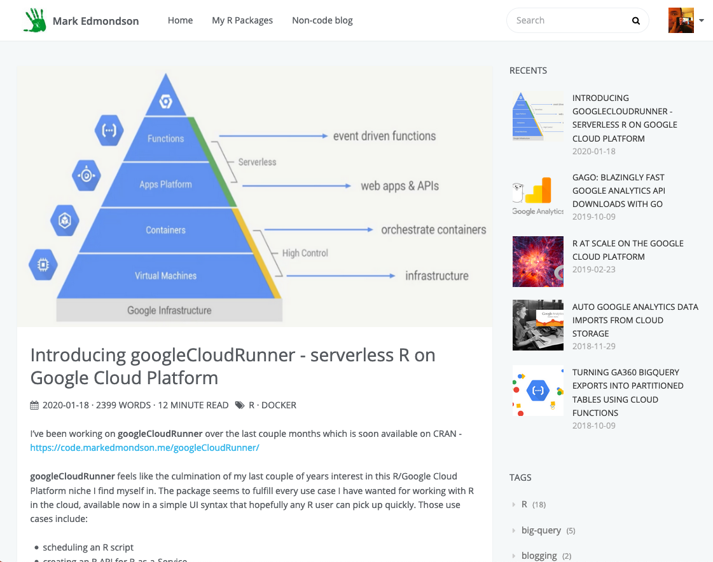
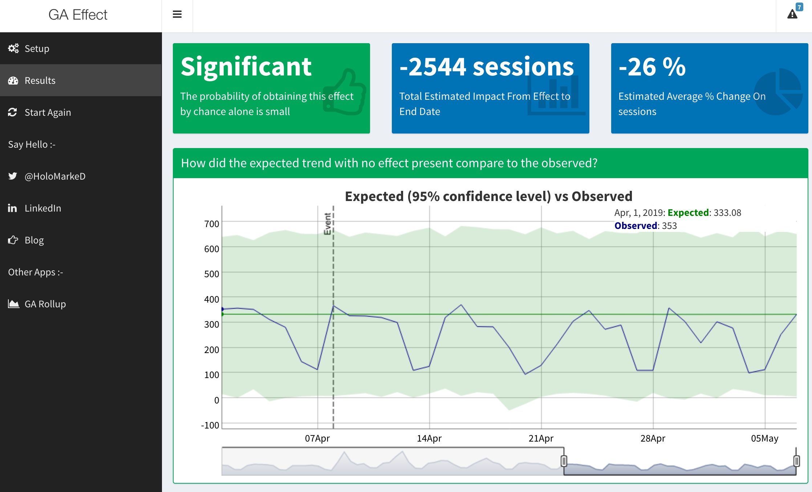
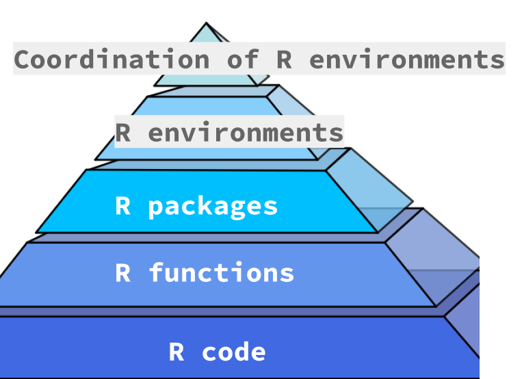
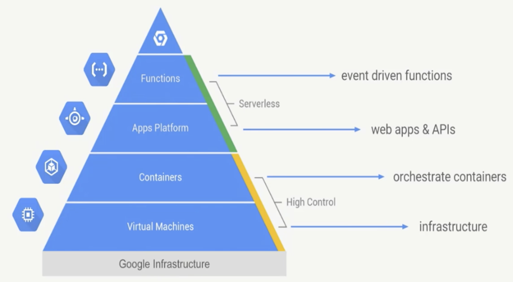
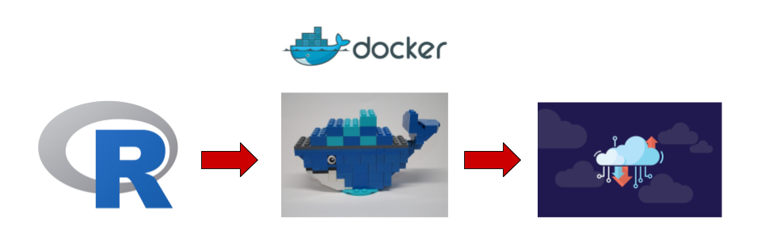
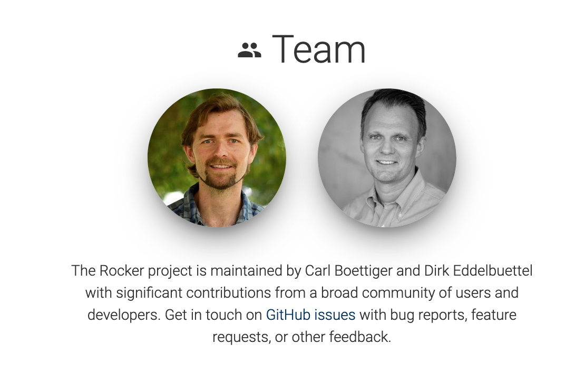
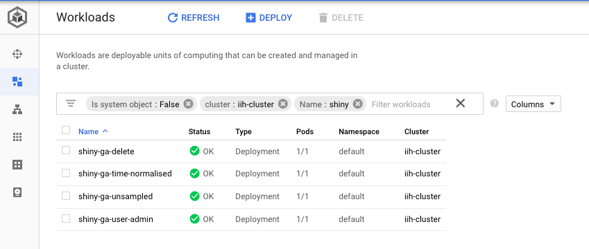
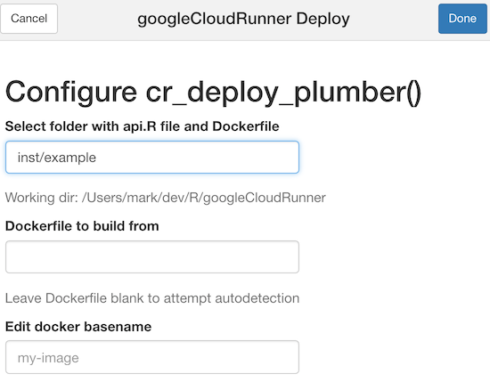
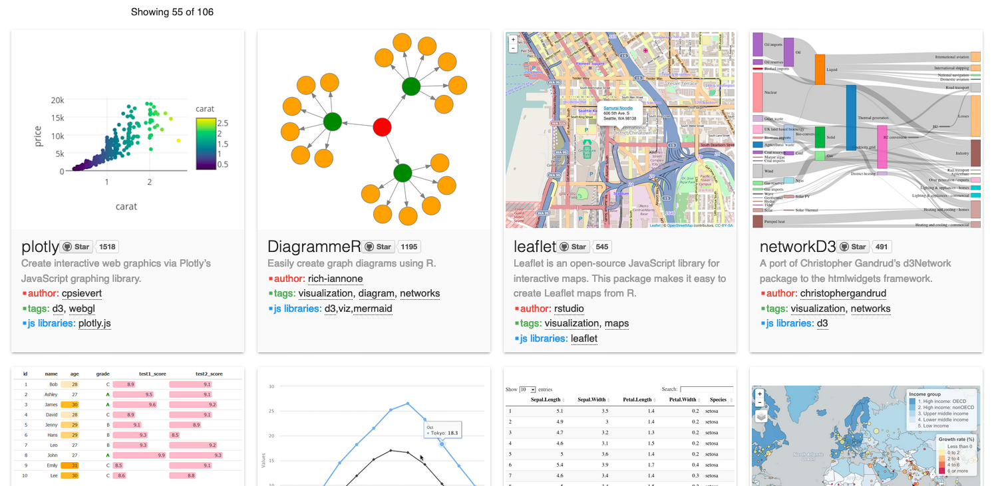

## code.markedmondson.me



# Credentials

## My R Timeline

- Digital marketing data since 2007
- useR since 2012 - Motive: how to use all this web data?
- Google Developer Expert - Google Analytics & Google Cloud
- Part of cloudyr group (AWS/Azure/GCP R packages for the cloud) https://cloudyr.github.io/
- Now: Data Engineer @ IIH Nordic

## GA Effect



## googleAuthRverse

* `searchConsoleR`
* `googleAnalyticsR` 
* `googleAuthR` -> `gargle`
* `googleComputeEngineR` (cloudyr)  
* `googleCloudStorageR` (cloudyr)
* `bigQueryR` (cloudyr)
* `googleLanguageR` (rOpenSci)
* `googleCloudRunner` (New!)

Slack: #googleAuthRverse 

## Agenda today

* Abstracting R applications into the Cloud using Docker (10min)
* Demo on what that abstraction offers (10 min)
* My evolving mindset for using R/Docker/Cloud (10 min)
* Any questions? (10 min)

# Abstracting R applications into the Cloud using Docker {data-background=#ff0000}

## What is..?

> Docker - a container system for building and sharing applications

> Cloud - computing delivered via the internet, not locally

## What does serverless offer?

> Serverless - cloud services that often use containers to host applications without configuring servers

- Focus on code, not dev-ops
- Scale from 0 to billions
- Reliability and security
- Abstraction

## Climbing up the pyramid - R



## Climbing up the pyramid - Cloud



## The keystone



* R - abstraction of R environments
* Cloud - run any code on cloud systems

## Docker + R = R in Production

* *Flexible* 
No need to ask IT to install R places, use `docker run`; across cloud platforms; ascendent tech

* *Version controlled*
No worries new package releases will break code

* *Scalable*
Run multiple Docker containers at once, fits into event-driven, stateless serverless future

## Docker levels the playing ground between languages

> Docker levels the playing ground between languages

## Dockerfiles from The Rocker Project

https://www.rocker-project.org/

Maintain useful R images

* `rocker/r-ver`
* `rocker/rstudio`
* `rocker/tidyverse`
* `rocker/shiny`
* `rocker/ml-gpu`

## Thanks to Rocker Team



## Dockerfiles

```sh
FROM rocker/tidyverse:3.6.0
MAINTAINER Mark Edmondson (r@sunholo.com)

# install R package dependencies
RUN apt-get update && apt-get install -y \
    libssl-dev 

## Install packages from CRAN
RUN install2.r --error \ 
    -r 'http://cran.rstudio.com' \
    googleAuthR \ 
    googleComputeEngineR \ 
    googleAnalyticsR \ 
    searchConsoleR \ 
    googleCloudStorageR \
    bigQueryR \ 
    ## install Github packages
    && installGithub.r MarkEdmondson1234/youtubeAnalyticsR \
    ## clean up
    && rm -rf /tmp/downloaded_packages/ /tmp/*.rds \
```

# Demo {data-background=#ff0000}

## Schedule an R script in the Cloud

**Demo an Rmd script pulling data from googlesheets**

## Create an R API that scales from 0 to 1 billion

**Demo a plumber script with Cloud Pub/Sub**

## Build a website for your package

**Demo cloudbuild.yml building website via pkgdown**

## googleCloudRunner - Use Cases

```r
install.packages("googleCloudRunner")
library(googleCloudRunner)
```

As easy as possible enabling of R use cases in the Cloud

* Scheduled R scripts
* Long-running R scripts
* Scale to 0 R APIs
* Continuous development

# My evolving mindset for using Docker/Cloud {data-background=#ff0000}

## A use anywhere R/RStudio

* Configure RStudio Server just like home...?
* Doesn't use the cloud to full potential

```r
library(googleComputeEngineR)
gce_vm(template = "rstudio", name = "my-rstudio-server",
       username = "mark", password = "r2020",
       predefined_type = "n1-highmem-2")
```

## A tailored R environment per task

* Workshops with material pre-loaded
* ML vs googleauthrverse vs shiny vs ...

```r
library(googleComputeEngineR)
gce_vm(name = "deeplearning-r", 
       template = "rstudio-gpu", 
       username = "mark", password = "mark123", 
       acceleratorType = "nvidia-tesla-k80")
```

## Scaling up R environments

* library(future) for cluster parallel work
* Run many of the same R environments at a time
* R APIs, Shiny Apps

```r
library(future)
library(googleComputeEngineR)

vms <- gce_vm_cluster()
plan(cluster, workers = as.cluster(vms))

f <- function(my_data, args){
   ## ....expensive...computations
   result
}

result %<-% f(my_data) 
```

## Separation of code and data (and config)

* Good data science principle applicable in good cloud setups
* The right service for the right job - BigQuery, Cloud Storage


## Kubernetes

Docker image originally for GCE, deployed to Kubernetes:

```sh
kubectl run shiny1 \
  --image gcr.io/gcer-public/shiny-googleauthrdemo:prod \
  --port 3838

kubectl expose deployment shiny1 \
  --target-port=3838  --type=NodePort
```

https://code.markedmondson.me/r-on-kubernetes-serverless-shiny-r-apis-and-scheduled-scripts/

### Shiny apps on k8s



## Batch jobs

Cloud Build (like the demo earlier - build Rmd on a schedule)

```r
library(googleCloudRunner)
cr_deploy_packagetests()
```

## R APIs

Cloud Run (like the demo earlier - trigger R code from events)



## Adapt plumber API for the model

```r
library(googleAnalyticsR)

#' Return output data from the ga_time_normalised ga_model
#' @param viewID The viewID for Google Analytics
#' @get /data
function(viewID=""){
  model <- ga_time_normalised(viewID)
  model$output
}

#' Plot out data from the ga_time_normalised ga_model
#' @param viewID The viewID for Google Analytics
#' @get /plot
#' @serializer htmlwidget
function(viewID=""){
  model <- ga_time_normalised(viewID)
  model$plot
}
```

## htmlwidgets

`@serialiser htmlwidgets` is great

http://gallery.htmlwidgets.org/




## Separation of code opens up possibilities

* Docker on VM - GPU support, ML dev work
* Kubernetes - Shiny apps
* Cloud Build - batch jobs
* Cloud Run - R APIs, event driven workflows

# Summary {data-background=#ff0000}

## Take-aways

* Abstracting R environments using Docker opens up horizons on what R can do
* Abstraction offers ways to make hard things easier for common R tasks
* Separation of R environment code, data and config makes applications very transferable to the best tool for the job

## Gratitude

* Thank you for listening
* Thanks to Anne Petersen for inviting me
* Thanks to R Core team for Rv1.0.0 and beyond
* Thanks to RStudio for all their cool things
* Thanks again to Rocker
* Thanks to Google for Developer Expert programme

## Say hello

* @HoloMarkeD
* https://code.markedmondson.me
* Contact us at IIH Nordic to build scale for you mark@iihnordic.com
* Any questions now?

