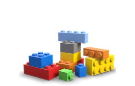
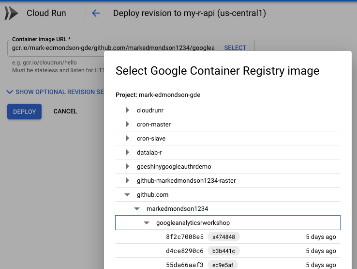

## code.markedmondson.me

<style>
.reveal section img { background:none; border:none; box-shadow:none; }
</style>


# Credentials {data-background=#ff0000}

## My R Timeline

- Digital marketing data since 2007
- useR since 2012 - how to use all this web data?
- Google Developer Expert 2014 - Google Analytics & Google Cloud
- Part of cloudyr group (AWS/Azure/GCP R packages for the cloud) https://cloudyr.github.io/
- Data Engineer @ IIH Nordic

## GA Effect


## googleAuthRverse

* `searchConsoleR`
* `googleAnalyticsR` 
* `googleAuthR` -> `gargle`
* `googleComputeEngineR` (cloudyr)  
* `googleCloudStorageR` (cloudyr)
* `bigQueryR` (cloudyr)
* `googleLanguageR` (rOpenSci)
* `googleCloudRunner` (New!)

Slack: #googleAuthRverse 

## Agenda today

* Abstracting R applications into the Cloud using Docker (10min)
* Demo on what that abstraction offers (10 min)
* My evolving mindset for using R/Docker/Cloud (10 min)
* Any questions? (10 min)

# R in the Cloud using Docker {data-background=#ff0000}

## What is..?

> Docker - a container system for building and sharing applications

> Cloud - computing delivered via the internet, not locally

## What does serverless offer?

> Serverless - cloud services that often use containers to host applications without configuring servers

- Focus on code, not dev-ops
- Scale from 0 to billions
- Reliability and security
- Abstraction

## Climbing up the R pyramid


## Climbing up the Cloud pyramid


## The keystone


* R - abstraction of R environments
* Cloud - run any code on cloud systems

## Docker + R = R in Production

* *Flexible* 
No need to ask IT to install R places, use `docker run`; across cloud platforms; ascendent tech

* *Version controlled*
No worries new package releases will break code

* *Scalable*
Run multiple Docker containers at once, fits into event-driven, stateless serverless future

## {data-background=#ff0000}

> Docker levels the playing ground between languages in the cloud

## {data-background="the-rocker-project.png"}

## Useful R Docker images

* `rocker/r-ver`
* `rocker/rstudio`
* `rocker/tidyverse`
* `rocker/shiny`
* `rocker/ml-gpu`

## Thanks to Rocker Team


## Dockerfiles

```sh
FROM rocker/tidyverse:3.6.0

# install R package dependencies
RUN apt-get update && apt-get install -y \
    libssl-dev 

## Install packages from CRAN
RUN install2.r --error \ 
    -r 'http://cran.rstudio.com' \
    googleAnalyticsR \ 
    searchConsoleR \ 
    googleCloudStorageR \
    bigQueryR \ 
    ## install Github packages
    && installGithub.r MarkEdmondson1234/youtubeAnalyticsR
```

# Demo {data-background=#ff0000}

## Schedule an R script in the Cloud

<iframe width="560" height="315" src="https://www.youtube.com/embed/BainmerWVb0" frameborder="0" allow="accelerometer; autoplay; encrypted-media; gyroscope; picture-in-picture" allowfullscreen></iframe>

## Create an R API that scales from 0 to 1 billion

<iframe width="560" height="315" src="https://www.youtube.com/embed/MoKHsFr1B88" frameborder="0" allow="accelerometer; autoplay; encrypted-media; gyroscope; picture-in-picture" allowfullscreen></iframe>

## googleCloudRunner - Use Cases

```r
install.packages("googleCloudRunner")
library(googleCloudRunner)
```

As easy as possible enabling of R use cases in the Cloud

* Scheduled R scripts (API calls, data updates)
* Long-running R scripts (Batched R scripts)
* Scale to 0 R APIs (R events, R-a-a-Service)
* Continuous development (build R website/packages upon Git commit)

# My evolving mindset for using Docker/Cloud {data-background=#ff0000}

## A use anywhere R/RStudio

* Configure RStudio Server just like home...?

```r
library(googleComputeEngineR)
gce_vm(template = "rstudio", name = "my-rstudio-server",
       username = "mark", password = "r2020",
       predefined_type = "n1-highmem-2")
```

* Doesn't use the cloud to full potential

## Tailored R environment

* Workshops with material pre-loaded
* ML training machine
* package sets (tidyverse, googleauthrverse etc.)
* Shiny

```r
library(googleComputeEngineR)
gce_vm(name = "deeplearning-r", 
       template = "rstudio-gpu", 
       username = "mark", password = "mark123", 
       acceleratorType = "nvidia-tesla-k80")
```

## Scaling up R

* library(future) for cluster parallel work
* Run many of the same R environments at a time

```r
library(future)
library(googleComputeEngineR)

vms <- gce_vm_cluster()
plan(cluster, workers = as.cluster(vms))

f <- function(my_data, args){
   ## ....expensive...computations
   result
}

result %<-% f(my_data) 
```

## Code. Data. Config.



* Good data science principles -> Good Cloud principles
* The right tool for the data - BigQuery, Cloud Storage etc.
* Switch configuration via environment args, yaml etc.

## Swap to new platforms



## Kubernetes

Docker image originally for GCE, deployed to Kubernetes:

```sh
kubectl run shiny1 \
  --image gcr.io/gcer-public/shiny-googleauthrdemo:prod \
  --port 3838

kubectl expose deployment shiny1 \
  --target-port=3838  --type=NodePort
```

https://code.markedmondson.me/r-on-kubernetes-serverless-shiny-r-apis-and-scheduled-scripts/

## Shiny apps on k8s


## Build R on a schedule

Cloud Build (like the demo earlier)


## Trigger R on events

Cloud Run (like the demo earlier)


## My current R / Cloud setup

Same R/Docker container, many options:

* Docker on VM - GPU support, ML dev work
* Kubernetes - Shiny apps
* Cloud Build - Batched and scheduled jobs
* Cloud Run - R APIs, event driven workflows

Ability to share R code with non-R users

# Summary {data-background=#ff0000}

## Take-aways

* Abstracting R using Docker opens up R horizons
* Cloud offers to make hard things easy for R tasks
* Code & data & config separation means best tool for the job

## Gratitude

* Thank you for listening
* Thanks to Anne Petersen for inviting me
* Thanks to R Core team for Rv1.0.0 and beyond
* Thanks to RStudio for all their cool things
* Thanks again to Rocker
* Thanks to Google for Developer Expert programme

## Say hello


* Twitter - @HoloMarkeD
* Blog - https://code.markedmondson.me
* Help working with R in the Cloud - mark@iihnordic.com
* Any questions now?

