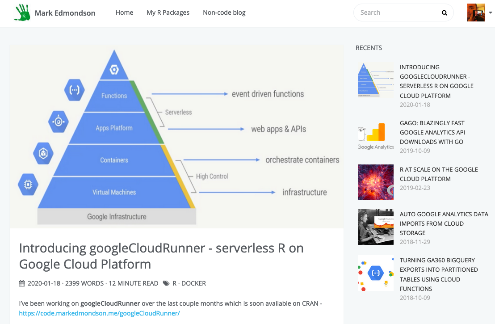

## code.markedmondson.me



# Credentials

## My R Timeline


## GA Effect


## googleAuthRverse

* `searchConsoleR`
* `googleAuthR`
* `googleAnalyticsR` 
* `googleComputeEngineR` (cloudyr)  
* `bigQueryR` (cloudyr)
* `googleCloudStorageR` (cloudyr)
* `googleLanguageR` (rOpenSci)
* `googleCloudRunner` (New!)

Slack group to talk around the packages #googleAuthRverse 

# Motivation

## Schedule an R script in the Cloud


## Create an R API that scales from 0 to 1 billion


## Build a website for your package


## googleCloudRunner - Use Cases

# Climbing up the pyramid

## R programming

## Cloud execution

## The Pyramid is Abstraction

# Abstraction in R

## R features

## R weaknesses

# Abstraction in Cloud

## From bare metal to serverless

## Docker is the key

## How Docker helps R weaknesses

## Docker levels the playing ground between languages

# Rockerverse

## R Rockerverse packages

## How Cloud thinking has evolved my R use

# How Cloud has evolved use of Docker

## Why GCP for me

## Which GCP compute service?

## R on GCE VMs

## R on Kubernetes

## Serverless R

### Cloud Run

### Cloud Build

# How googleCloudRunner represents this

## What the demos did


## What you can do

# Summary

## Take aways


## Dockerfiles from The Rocker Project

https://www.rocker-project.org/

Maintain useful R images

* `rocker/r-ver`
* `rocker/rstudio`
* `rocker/tidyverse`
* `rocker/shiny`
* `rocker/ml-gpu`

## Thanks to Rocker Team


## Dockerfiles

```sh
FROM rocker/tidyverse:3.6.0
MAINTAINER Mark Edmondson (r@sunholo.com)

# install R package dependencies
RUN apt-get update && apt-get install -y \
    libssl-dev 

## Install packages from CRAN
RUN install2.r --error \ 
    -r 'http://cran.rstudio.com' \
    googleAuthR \ 
    googleComputeEngineR \ 
    googleAnalyticsR \ 
    searchConsoleR \ 
    googleCloudStorageR \
    bigQueryR \ 
    ## install Github packages
    && installGithub.r MarkEdmondson1234/youtubeAnalyticsR \
    ## clean up
    && rm -rf /tmp/downloaded_packages/ /tmp/*.rds \
```

## Docker + R = R in Production

* *Flexible* 
No need to ask IT to install R places, use `docker run`; across cloud platforms; ascendent tech

* *Version controlled*
No worries new package releases will break code

* *Scalable*
Run multiple Docker containers at once, fits into event-driven, stateless serverless future

## Creating Docker images with Cloud Build

Continuous development with GitHub pushes


## Images versioned in private repository


# Scaling R scripts, Shiny apps and APIs

## Strategies to scale R

* *Vertical scaling* - increase the size and power of one machine
* *Horizontal scaling* - split up your problem into lots of little machines
* *Serverless scaling* - send your code + data into cloud and let them sort out how many machines

# Vertical scaling

## Bigger boat


## Bigger VMs

Good for one-off workloads

Pros

    Probably run the same code with no changes needed
    Easy to setup

Cons

    Expensive
    May be better to have data in database

## Launching a monster VM in the cloud

3.75TB of RAM: $423 a day (compare ~$1 a day for standard tier VM)

```r
library(googleComputeEngineR)

# this will cost a lot
bigmem <- gce_vm("big-mem", 
                 template = "rstudio", 
                 predefined_type = "n1-ultramem-160")
```

## RStudio Server


## Standard VM serving Shiny

```r
library(googleComputeEngineR)

# your customised Docker image built via Build Triggers
custom_image <- gce_tag_container("custom-shiny-app", 
                                  "your-project")
## make new Shiny template VM for your self-contained Shiny app
vm <- gce_vm("myapp", 
             template = "shiny",
             predefined_type = "n1-standard-2",
             dynamic_image = custom_image)
```

## Cloud computing considerations

* Only charged for uptime, can configure lots of VMs so...
* Have lots of specialised VMs (Docker images) not one big workstation
* Keep code and data separate e.g. `googleCloudStorageR` or `bigQueryR`
* Consider VMs as like functions of computing power

# Horizontal scaling

## Lots of little machines can accomplish great things


## Parellise your code

Good for parallelisable or scheduled data tasks

Pros

    Fault redundency
    Forces repeatable/reproducable infrastructure
    library(future) makes parallel processing very useable

Cons

    Changes to your code for split-map-reduce
    Write meta code to handle I/O data and code
    Not applicable to some problems

## Adopt a split-map-reduce mindset

* Break problems down into stateless lumps
* Reuseable bricks that can be applied to other tasks


## Setup a cluster

New in `googleComputeEngineR` v0.3 - shortcut that launches cluster, checks authentication for you

```r
library(googleComputeEngineR)

vms <- gce_vm_cluster()
#2019-03-29 23:24:54> # Creating cluster with these arguments:template = r-base,dynamic_image = rocker/r-parallel,wait = 
#FALSE,predefined_type = n1-standard-1
#2019-03-29 23:25:10> Operation running...
...
#2019-03-29 23:25:25> r-cluster-1 VM running
#2019-03-29 23:25:27> r-cluster-2 VM running
#2019-03-29 23:25:29> r-cluster-3 VM running
...
#2019-03-29 23:25:53> # Testing cluster:
r-cluster-1 ssh working
r-cluster-2 ssh working
r-cluster-3 ssh working
```

## library(future)

`googleComputeEngineR` has custom method for `future::as.cluster`

```r
## make a future cluster
library(future)
library(googleComputeEngineR)

vms <- gce_vm_cluster()
plan(cluster, workers = as.cluster(vms))

...do parallel...
```

## Forecasting example

```r
# create cluster
vms <- gce_vm_cluster("r-vm", cluster_size = 3)
plan(cluster, workers = as.cluster(vms))

# get data                          
my_files <- list.files("myfolder")
my_data <- lapply(my_files, read.csv)

# forecast data in cluster
library(forecast)
cluster_f <- function(my_data, args = 4){
   forecast(auto.arima(ts(my_data, frequency = args)))
}
result <- future_lapply(my_data, cluster_f, args = 4) 
```

## Multi-layer future loops

Can multi-layer future loops (use each CPU within each VM)

Thanks for Grant McDermott for figuring optimal method ([Issue #129](https://github.com/cloudyr/googleComputeEngineR/issues/129))

```r
future_sim <- 
  ## Outer future_lapply() call loops over the no. of VMS
  future_lapply(1:length(vms), FUN = function(x) { 
  
    ## Inner future_lapply() call loops over desired no. of iterations / no. of VMs
    future_lapply(1:(iters/length(vms)), FUN = slow_func) 
    
  })
```

## CPU utilization

3 VMs, 8 CPUs each = 24 threads (~$3 a day)


# Serverless scaling

## We spoke previously of

Clusters of VMs + Docker = Horizontal scaling

## Kubernetes 

Clusters of VMs + Docker + *Task controller* = Kubernetes


## Kubernetes 

Good for Shiny

Pros

    Auto-scaling, task queues etc.
    Scale to billions
    Potentially cheaper
    May already have cluster in your organisation

Cons

    Needs stateless, idempotent workflows
    Message broker?
    Minimum 3 VMs
    Can get complicated


## Dockerfiles for Shiny apps

Built on Cloud Build upon GitHub push

```sh
FROM rocker/shiny
MAINTAINER Mark Edmondson (r@sunholo.com)

# install R package dependencies
RUN apt-get update && apt-get install -y \
    libssl-dev
    
## Install packages from CRAN needed for your app
RUN install2.r --error \ 
    -r 'http://cran.rstudio.com' \
    googleAuthR \
    googleAnalyticsR

## assume shiny app is in build folder /shiny
COPY ./shiny/ /srv/shiny-server/myapp/
```

## Kubernetes deployments - Shiny

```sh
kubectl run shiny1 \
  --image gcr.io/gcer-public/shiny-googleauthrdemo:prod \
  --port 3838

kubectl expose deployment shiny1 \
  --target-port=3838  --type=NodePort
```

## Expose your workloads via Ingress

```yaml
apiVersion: extensions/v1beta1
kind: Ingress
metadata:
  name: r-ingress-nginx
spec:
  rules:
  - http:
      paths:
      - path: /gar/
      # app deployed to /gar/shiny/
        backend:
          serviceName: shiny1
          servicePort: 3838
```

## Shiny apps waiting for service


## IIH Nordic's Shiny Apps


# New! Cloud Run

## Cloud Run


* Built on top of Kubernetes via Knative
* Managed Container-as-a-Service

## Cloud Run Pros/Cons

Good for R APIs

Pros

    Auto-scaling
    Scale from 0
    Simple to deploy
    https / authentication embedded

Cons

    Needs stateless, idempotent workflows
    No websockets yet (no Shiny :( )

## plumber APIs 

https://www.rplumber.io/

Make an API out of your script:

```r
#' @get /hello
#' @html
function(){
  "<html><h1>hello world</h1></html>"
}
```

## Adapt plumber API for the model

```r
library(googleAnalyticsR)

#' Return output data from the ga_time_normalised ga_model
#' @param viewID The viewID for Google Analytics
#' @get /data
function(viewID=""){
  model <- ga_time_normalised(viewID)
  model$output
}

#' Plot out data from the ga_time_normalised ga_model
#' @param viewID The viewID for Google Analytics
#' @get /plot
#' @serializer htmlwidget
function(viewID=""){
  model <- ga_time_normalised(viewID)
  model$plot
}

```

## htmlwidgets

`@serialiser htmlwidgets` is great

http://gallery.htmlwidgets.org/


## Adapt plumber API for the model - test in local R session

```r
library(plumber)
r <- plumb("api.R")
r$run(port=8000)
```

Creates a webserver to run the R code.

* In browser: http://localhost:8000/plot?viewID=81416156
* via curl: `curl http://localhost:8000/data?viewID=81416156`

## Cloud Run deployment

See [`cloudRunR`](https://github.com/MarkEdmondson1234/cloudRunR)


## Cloud Run Docker file

Based on:

```
FROM trestletech/plumber
LABEL maintainer="mark"

COPY [".", "./"]

ENTRYPOINT ["R", "-e", 
            "pr <- plumber::plumb(commandArgs()[4]); 
            pr$run(host='0.0.0.0', 
                   port=as.numeric(Sys.getenv('PORT')))"]
CMD ["api.R"]
```

## Cloud Run Docker file - autogenerated

```r
library(containerit)
dd <- dockerfile("api.R")
write(dd, "Dockerfile")
```

And add any packages needed by model.


## Cloud Run deployment - server-side auth

* Server-side - JSON credentials file for GA account in api.R

```r
library(googleCloudStorageR)
if(!is.null(googleAuthR::gar_gce_auth())){
  gcs_get_object("ga-auth.json", bucket="your-bucket",
                 saveToDisk = "ga-auth.json", overwrite = TRUE)
}

library(googleAnalyticsR)
#..do calls..
```

## Cloud Run deployment - client-side auth

* Client-side - use Cloud Run's authenticated calls to restrict API calls


## Continuous Development with Cloud Build

Set up a build trigger for the [GitHub repo](https://github.com/MarkEdmondson1234/googleAnalyticsRWorkshop) you commit the Dockerfile to:


## Cloud Build successful


## Deploy to Cloud Run


## Deployed on Cloud Run

Can scale to a billion, and be available for other languages.

* Website plot: https://my-r-api-ewjogewawq-uc.a.run.app/plot?viewID=81416156
* Curl: `curl https://my-r-api-ewjogewawq-uc.a.run.app/data?viewID=81416156`


# I thought I knew a bit about R and Google Cloud but then...

## GoogleNext19 - Data Science at Scale with R on GCP

A 40 mins talk at Google Next19 with lots of new things to try!

https://www.youtube.com/watch?v=XpNVixSN-Mg&feature=youtu.be


## New concepts

Great video that goes more into Spark clusters, Jupyter notebooks, training using ML Engine and scaling using Seldon on Kubernetes that I haven't tried yet


## Some shots from the video


## Google Cloud Platform - Serverless Pyramid {data-transition="slide-in fade-out"}


## Google Cloud Platform - R applications {data-transition="fade"}


# Conclusions

## Take-aways

* Anything scales on Google Cloud Platform, including R
* Docker docker docker
* library(future)
* Pick scaling stategy most suitable for you

## Gratitude

* Thank you for listening
* Thanks to Anna for inviting me
* Thanks to RStudio for all their cool things.  Support them by buying their stuff.
* Thanks again to Rocker
* Thanks to Google for Developer Expert programme and building cool stuff.

## Say hello afterwards

* @HoloMarkeD
* https://code.markedmondson.me
* Contact us at IIH Nordic to build scale for you mark@iihnordic.com


